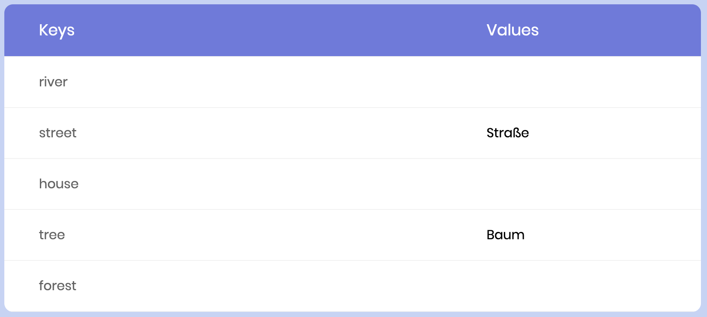

# key-value-learner
Learn anything that can be learnt as a key-value-pair!

Just open index.html, remember the value and click to check whether you remembered it correctly.

Got the CSS from [here](https://colorlib.com/wp/css3-table-templates)

## setup
Rename js/content_template.js to js/content.js and start learning by clicking on the values.

I made this for learning on a mobile phone. Also works on desktop.